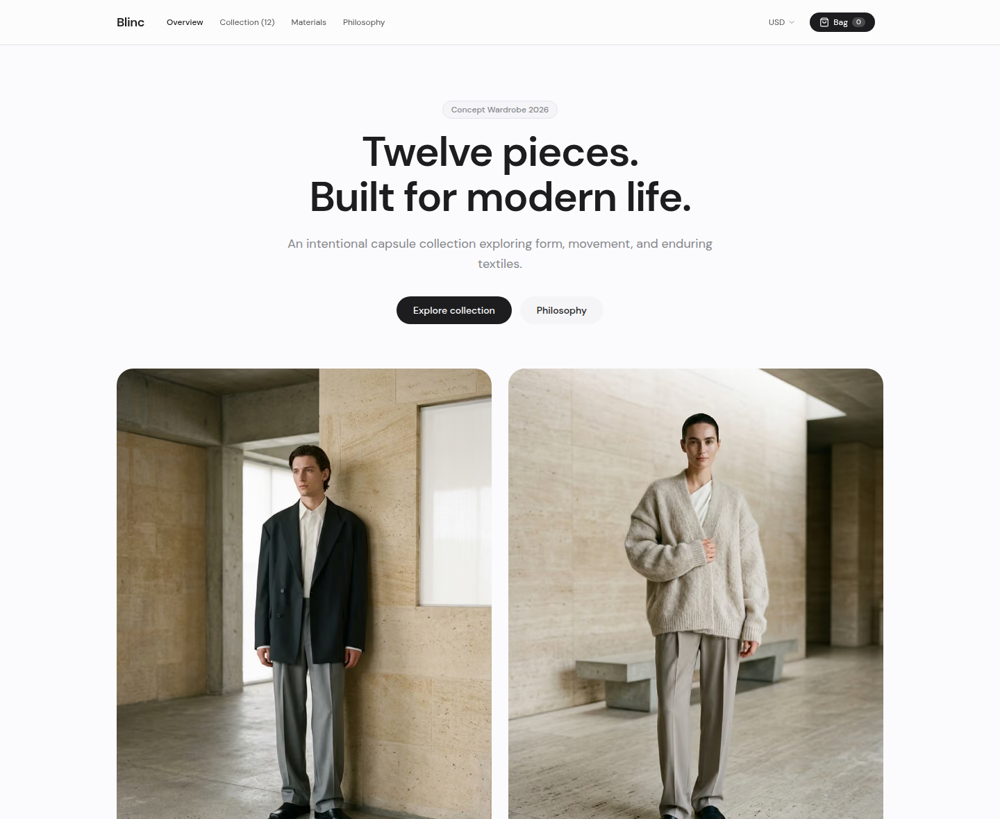
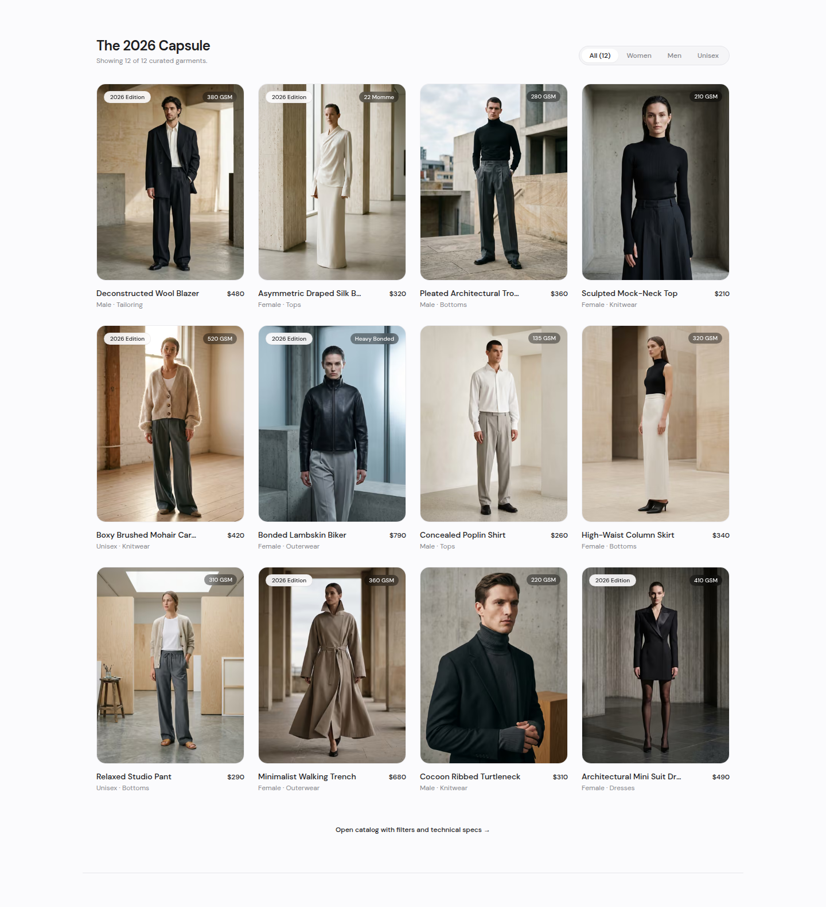
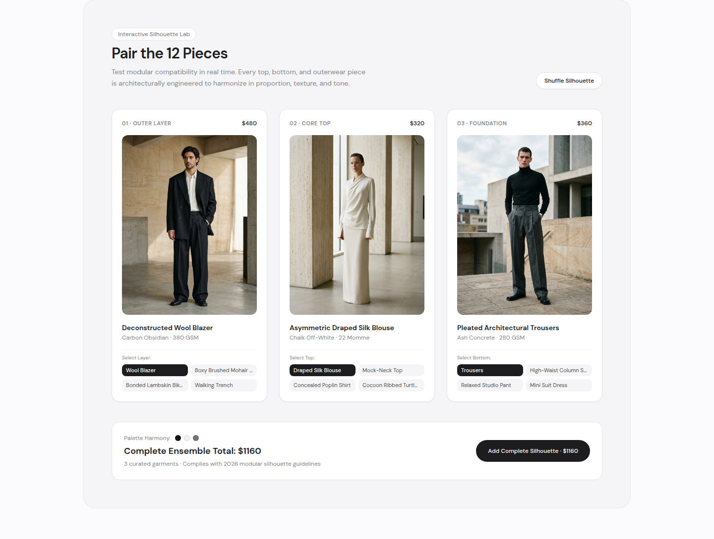
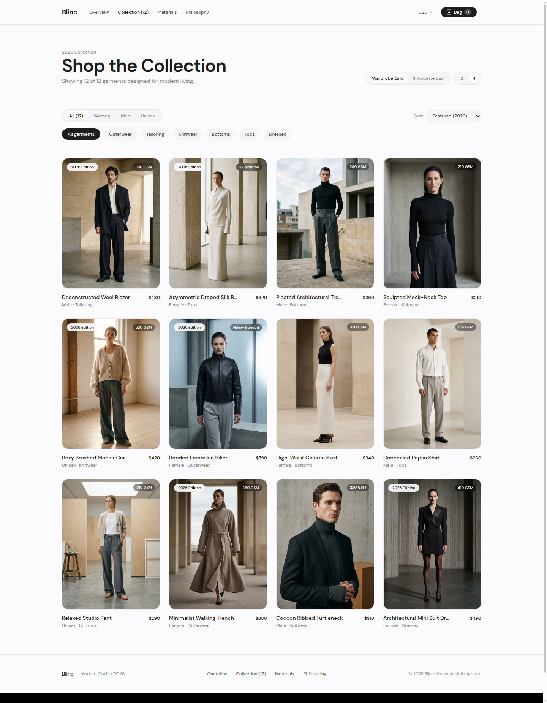
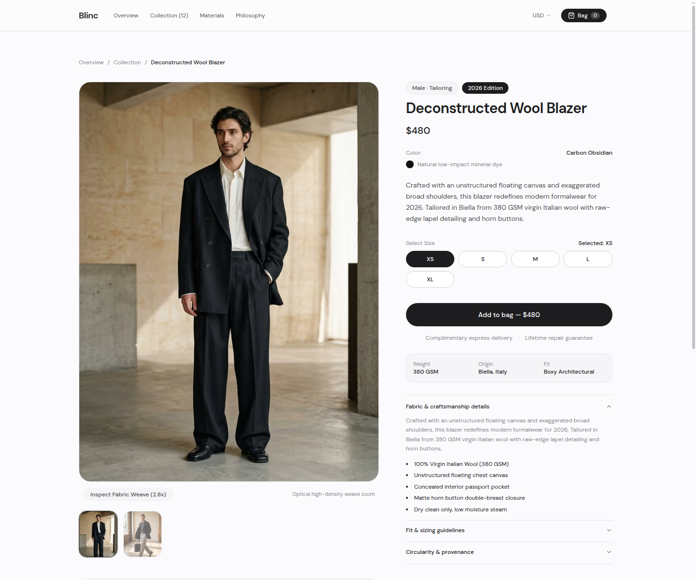
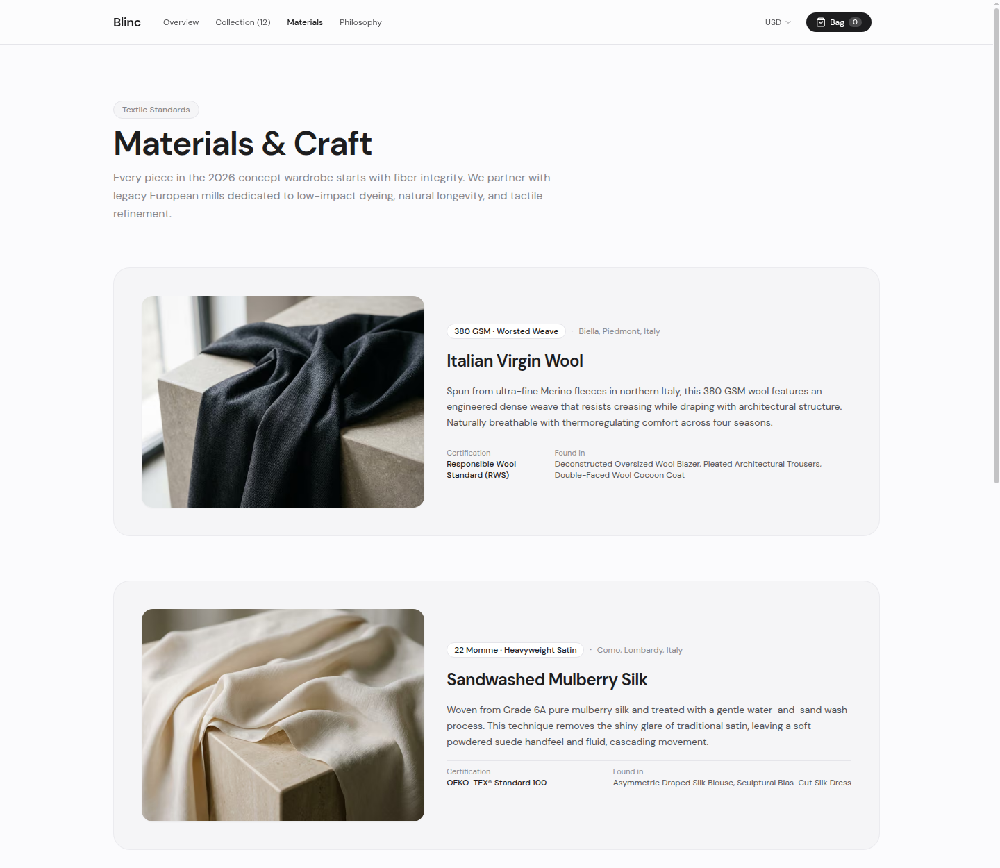
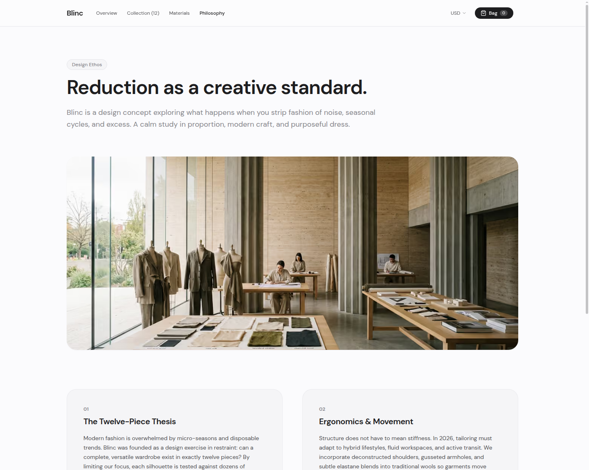

# BLINC — 2026 Architectural Luxury Concept Wardrobe

Blinc is an avant-garde digital luxury concept wardrobe engineered with Next.js 16 (App Router), React 19, and Tailwind CSS v4.

Designed through the aesthetic lens of Tactile Brutalism and Quiet Luxury, Blinc translates the disciplined materiality, typography, and proportions of editorial print lookbooks into a responsive, high-performance web experience.

---

## Design Showcase & Visual Architecture

### 01. Editorial Flagship Hero


The landing experience establishes the brand's visual identity through monolithic typography, expansive whitespace, and high-key dual lookbook photography captured in travertine architectural spaces. A clean navigation system provides immediate access to the 12-piece wardrobe, textile library, brand philosophy, and multi-currency selector.

---

### 02. The 2026 Capsule Collection Grid


The main catalog presents all 12 garments in a balanced 4-column editorial grid. Each garment card displays precise metadata including technical fabric weight badges (GSM), gender category indicators, silhouettes, pricing, and seamless cross-fade previews on hover.

---

### 03. Interactive Silhouette Lab (CapsuleMixer)


An interactive 3-piece modular outfit builder enabling clients to assemble complete outfits in real time across three architectural layers:
- Layer 01: Outerwear and Tailoring (Blazers, Biker Jackets, Trenches)
- Layer 02: Core Tops and Knitwear (Silk Blouses, Cardigans, Turtlenecks)
- Layer 03: Foundation Bottoms (Pleated Trousers, Column Skirts, Studio Pants)

Features include real-time palette harmony verification (Carbon Obsidian, Chalk Off-White, Ash Concrete), algorithmic silhouette randomization, live ensemble total calculation, and one-click bundle addition to the shopping bag.

---

### 04. Full Wardrobe Catalog & Exploration


The comprehensive shop interface provides multi-faceted filtering and inspection tools:
- Gender segmentation: All (12), Women, Men, and Unisex
- Garment categorization: Outerwear, Tailoring, Knitwear, Bottoms, Tops, and Dresses
- Sort mechanisms: Featured 2026, Price (Low to High), Price (High to Low), and Newest
- View toggle: Switch seamlessly between the Wardrobe Grid and the Silhouette Lab
- Density switcher: Toggle between 2-column immersive view and 4-column catalog view

---

### 05. Product Detail & Tactile Specification Rail


Individual garment pages provide an editorial view of each design:
- Multi-angle high-resolution photography gallery
- 2.8x tactile weave zoom indicator for fabric texture inspection
- Proportion and size selector (XS through XL) with real-time stock feedback
- Technical specifications matrix detailing fabric weight (GSM), Italian mill origin, and architectural cut
- Interactive accordion tabs covering craftsmanship details, fit guidelines, and circularity provenance
- Direct integration with the slide-over bag drawer

---

### 06. Certified Textile & Craft Provenance


A dedicated textile archive detailing the fiber integrity and European mill partnerships behind each garment:
- Italian Virgin Wool: 380 GSM worsted weave tailored in Biella, Italy; Responsible Wool Standard (RWS) certified
- Sandwashed Mulberry Silk: 22 Momme heavyweight satin finished in Como, Italy; OEKO-TEX Standard 100 certified
- RMS Brushed Mohair: 520 GSM heavyweight knit from Biella, Italy; Responsible Mohair Standard certified
- French Lambskin and Neoprene: Heavy bonded composite constructed in Florence, Italy; REACH compliant

---

### 07. Brand Philosophy Atelier


The atelier manifesto outlines the foundational principles governing the Blinc wardrobe:
1. The Twelve-Piece Thesis: Eliminating seasonal micro-cycles in favor of twelve permanent, modular pieces.
2. Ergonomics & Movement: Translating architectural volume into fluid, unconstrained everyday drape.
3. Monolithic Simplicity: Hairline precision, calm mineral palettes, and absence of ornamental excess.
4. Radical Traceability: Transparent disclosure of fiber origins, fabric densities, and artisan ateliers.

---

### 08. Signature Watermark & Footer


The site concludes with an architectural signature footer containing secondary navigation, copyright certification, and the designer watermark:
- Designed and built by Jack Pision
- Direct profile links to GitHub (github.com/Jack-Pision) and X (x.com/Jack_pision)

---

## Curated 12-Piece Wardrobe Matrix

| Look | Garment Name | Category | Silhouette | Price (USD) | Primary Fabric & GSM | Origin Mill |
| :---: | :--- | :--- | :--- | :---: | :--- | :--- |
| 01 | Deconstructed Wool Blazer | Tailoring | Male / Unisex | $480 | 100% Virgin Wool (380 GSM) | Biella, Italy |
| 02 | Asymmetric Draped Silk Blouse | Tops | Female / Unisex | $320 | Sandwashed Mulberry Silk (22 Momme) | Como, Italy |
| 03 | Pleated Architectural Trousers | Bottoms | Male / Unisex | $360 | High-Twist Tropical Wool (280 GSM) | Porto, Portugal |
| 04 | Sculpted Mock-Neck Top | Knitwear | Female | $210 | Organic Modal & Spun Silk (210 GSM) | Kyoto, Japan |
| 05 | Boxy Brushed Mohair Cardigan | Knitwear | Unisex | $420 | RMS Mohair & Merino (520 GSM) | Biella, Italy |
| 06 | Bonded Lambskin Biker | Outerwear | Female / Unisex | $790 | Full-Grain French Lambskin + Neoprene | Florence, Italy |
| 07 | Concealed Poplin Shirt | Tops | Male / Unisex | $260 | Giza Long-Staple Cotton (135 GSM) | Milan, Italy |
| 08 | High-Waist Column Skirt | Bottoms | Female | $340 | Double-Faced Wool Crepe (320 GSM) | Porto, Portugal |
| 09 | Relaxed Studio Pant | Bottoms | Unisex | $290 | Japanese Cotton-Tencel Twill (310 GSM) | Okayama, Japan |
| 10 | Minimalist Walking Trench | Outerwear | Female / Unisex | $680 | Bonded Cotton Gabardine (360 GSM) | Lancashire, UK |
| 11 | Cocoon Ribbed Turtleneck | Knitwear | Male / Unisex | $310 | 16-Gauge Superfine Merino (220 GSM) | Biella, Italy |
| 12 | Architectural Mini Suit Dress | Dresses | Female | $490 | Silk-Wool Barathea (410 GSM) | Paris, France |

---

## Technical Stack & Architecture

- Framework: Next.js 16.3.6 (App Router) with Turbopack compilation engine.
- UI Library: React 19 with Concurrent Features and Server Components.
- Styling: Tailwind CSS v4 with custom CSS custom properties and invisible functional scrollbars.
- Image Pipeline: Next.js `<Image>` component configured for AVIF and WebP delivery with responsive sizing rules.
- State Architecture: Cart state managed via `CartContext.tsx` utilizing `useSyncExternalStore` and migration adapters (`migrateCartItem`) to prevent client/server hydration divergence across browser sessions.
- Static Generation: Full Static Site Generation (SSG) for all product dynamic routes via `generateStaticParams`.
- Typography: Syne Display paired with Geist Sans and Geist Mono.
- Asset System: 31 bespoke 2026 architectural luxury images generated and hosted locally in `public/images/`.

---

## Repository Structure

```
Blinc/
├── docs/
│   ├── RESEARCH_AND_IMPLEMENTATION_GUIDE.md  # In-depth brand & 2026 trend study
│   └── screenshots/                          # High-resolution UI captures
│       ├── 01-homepage-hero.png
│       ├── 02-capsule-collection.png
│       ├── 03-capsule-mixer.png
│       ├── 04-catalog-shop.png
│       ├── 05-product-detail.png
│       ├── 06-materials-craft.png
│       ├── 07-brand-philosophy.png
│       └── 08-footer-watermark.png
├── public/
│   └── images/                               # 31 local high-res photography assets
│       ├── hero/                             # Editorial lead imagery
│       ├── products/                         # 12-garment studio catalog photography
│       ├── materials/                        # Textile close-ups (Wool, Silk, Mohair, Leather)
│       └── philosophy/                       # Atelier architectural banners
├── scripts/
│   └── capture_docs_screenshots.py           # Automated headless documentation capture
├── src/
│   ├── app/
│   │   ├── globals.css                       # Design tokens and invisible functional scrollbar
│   │   ├── layout.tsx                        # Root layout with metadata and providers
│   │   ├── page.tsx                          # Editorial Flagship homepage
│   │   ├── materials/page.tsx                # Textile specifications archive
│   │   ├── philosophy/page.tsx               # Atelier design philosophy
│   │   ├── product/[slug]/page.tsx           # Dynamic SSG product detail page
│   │   └── shop/page.tsx                     # Full collection catalog with filters
│   ├── components/
│   │   ├── CapsuleMixer.tsx                  # 3-piece modular outfit builder
│   │   ├── CartDrawer.tsx                    # Slide-over bag drawer with checkout
│   │   ├── Footer.tsx                        # Footer with Jack Pision watermark
│   │   ├── Navbar.tsx                        # Header with currency & bag trigger
│   │   ├── ProductCard.tsx                   # Interactive catalog product card
│   │   └── TactileLoupe.tsx                  # 2.8x fabric inspection viewer
│   ├── context/
│   │   └── CartContext.tsx                   # Hydration-safe cart state store
│   ├── data/
│   │   └── products.ts                       # Curated 12-piece wardrobe database
│   └── types/
│       └── index.ts                          # TypeScript interface definitions
├── next.config.ts                            # Next.js configuration and image domains
├── package.json                              # Project dependencies and run scripts
├── tsconfig.json                             # TypeScript compiler configuration
└── README.md                                 # Project documentation
```

---

## Getting Started

### Prerequisites

- Node.js >= 18.18.0
- pnpm >= 9.0.0

### Installation

```bash
# Clone repository
git clone https://github.com/Jack-Pision/blinc.git

# Navigate to project directory
cd blinc

# Install dependencies
pnpm install
```

### Development Server

```bash
pnpm dev
```

Open [http://localhost:3000](http://localhost:3000) with your browser to explore the experience.

### Production Build

```bash
# Compile and optimize for production
pnpm build

# Start production server
pnpm start
```

### Code Quality

```bash
pnpm lint
```

---

## Verification & Testing

The Blinc codebase contains an automated headless Chrome testing suite verifying end-to-end user workflows:
- Home route rendering and hero asset loading
- 12-garment catalog display and metadata verification
- Gender and category filter state transitions
- CapsuleMixer 3-layer outfit composition, palette harmony, and price totalization
- Product detail pages with sizing selection and technical accordion panels
- Materials archive certifications and philosophy atelier tenets
- Shopping bag drawer operations (add, adjust quantity, remove, shipping progress)
- Currency switching across USD, EUR, GBP, and JPY

All checks pass with zero errors, zero hydration mismatches, and zero console warnings.

---

## Designer & Author

Designed and built by **Jack Pision**.

- GitHub: [github.com/Jack-Pision](https://github.com/Jack-Pision)
- X: [x.com/Jack_pision](https://x.com/Jack_pision)
